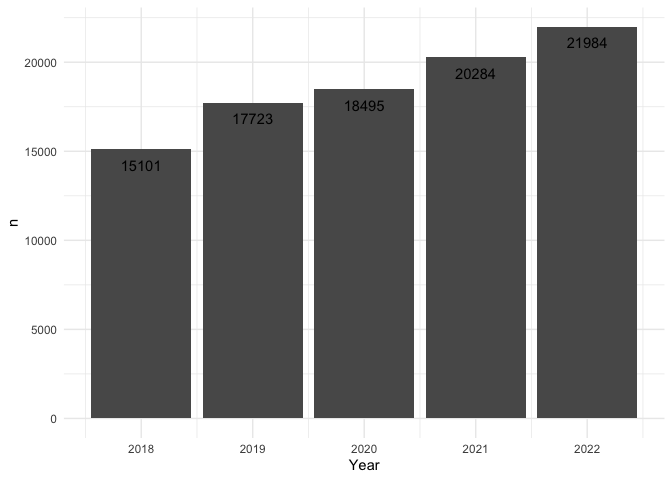
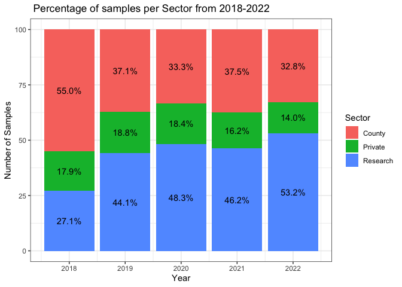
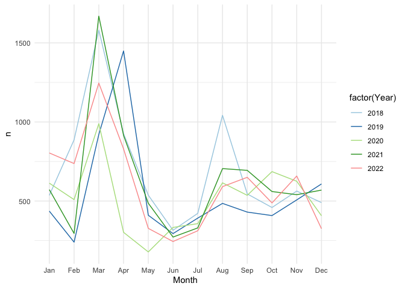
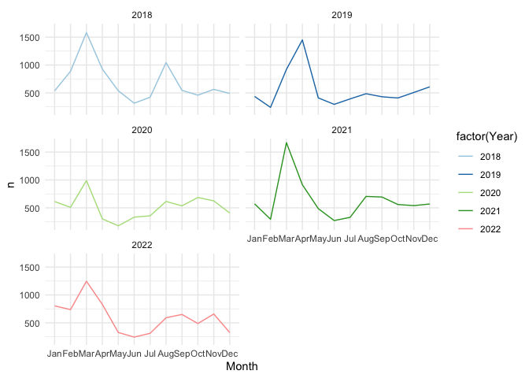

STL Project
================

## Clean and check data:

The first step is to clean and check the data.

``` r
#Import data to R
STL_2018_2022 <- read_csv("~/Desktop/Data/STL_2018-2022-5-15.csv", 
                          col_types = cols(LabNo = col_character(),Type = col_character(), 
                                           NO3W = col_double(), B = col_double()))
# Check errors
parsing_failures <- problems(STL_2018_2022)
parsing_failures
```

    ## # A tibble: 0 × 5
    ## # ℹ 5 variables: row <int>, col <int>, expected <chr>, actual <chr>, file <chr>

``` r
# Grouping by year----
g_years <- STL_2018_2022 %>% 
  count(Year)
g_years
```

    ## # A tibble: 5 × 2
    ##    Year     n
    ##   <dbl> <int>
    ## 1  2018 15101
    ## 2  2019 17723
    ## 3  2020 18495
    ## 4  2021 20284
    ## 5  2022 21984

## Plot

The number of total samples received during 2018-2022.

``` r
p_years <-ggplot (g_years, aes(x= Year, y=n)) + geom_bar (stat = "identity") + 
  geom_text(aes(label = n, vjust = 2)) + theme_minimal() 
p_years
```





- What percetages does each sector contributes to the total number of
  samples?

``` r
#Percentage stacked barplot -> Each sector with percentage----
percent_df <- STL_2018_2022 %>%
  count(Year, Sector) %>%  
  group_by(Year) %>%
  mutate(pct= prop.table(n) * 100) %>%
  drop_na() %>%
  ggplot() + aes(Year, pct, fill=Sector) +
  geom_bar(stat="identity") +
  ylab("Number of Samples") +
  geom_text(aes(label=paste0(sprintf("%1.1f", pct),"%")),
            position=position_stack(vjust=0.5)) +
  ggtitle(" Percentage of samples per Sector from 2018-2022") +
  theme_bw()

percent_df
```




## Evolution of number of samples

How the amount samples sent by the customer varies within a year?

``` r
#plot the samples over
STL_2018_2022 <- STL_2018_2022 %>%
  mutate(date = make_date(year = Year, month = Month, day = Day))

as.data.frame(STL_2018_2022) %>%
  mutate(Month = month.abb[lubridate::month(date, label = TRUE)],
         Year = lubridate::year(date))%>%
  head(., 10)
```

    ##    OrderDt Month Day Year LabNo              Customer Sector Type  pH Sikora_pH
    ## 1   2/1/18   Jan   2 2018  5970 Lion County Extension County   Ag 6.9        NA
    ## 2   2/1/18   Jan   2 2018  5971 Lion County Extension County   Ag 6.5        NA
    ## 3   2/1/18   Jan   2 2018  5961 Lion County Extension County   Ag 7.0        NA
    ## 4   2/1/18   Jan   2 2018  5962 Lion County Extension County   Ag 5.5        NA
    ## 5   2/1/18   Jan   2 2018  5963 Lion County Extension County   Ag 6.6        NA
    ## 6   2/1/18   Jan   2 2018  5964 Lion County Extension County   Ag 5.6        NA
    ## 7   2/1/18   Jan   2 2018  5965 Lion County Extension County   Ag 6.6        NA
    ## 8   2/1/18   Jan   2 2018  5966 Lion County Extension County   Ag 6.6        NA
    ## 9   2/1/18   Jan   2 2018  5967 Lion County Extension County   Ag 7.3        NA
    ## 10  2/1/18   Jan   2 2018  5968 Lion County Extension County   Ag 6.9        NA
    ##     OM NO3 NO3W     P   K Ca Mg Na  Zn Fe Mn Cu  S Cl SS CECS Al  B
    ## 1  3.8  NA   NA 11.20 278 NA NA NA 0.7 NA NA NA NA NA NA   NA NA NA
    ## 2  3.5  NA   NA  6.00 268 NA NA NA 0.4 NA NA NA NA NA NA   NA NA NA
    ## 3  5.6  NA   NA  5.17 320 NA NA NA 1.6 NA NA NA NA NA NA   NA NA NA
    ## 4  3.2  NA   NA  4.51 188 NA NA NA 0.7 NA NA NA NA NA NA   NA NA NA
    ## 5  3.3  NA   NA 24.10 269 NA NA NA 0.8 NA NA NA NA NA NA   NA NA NA
    ## 6  5.8  NA   NA  5.98 164 NA NA NA 1.3 NA NA NA NA NA NA   NA NA NA
    ## 7  3.2  NA   NA 19.00 241 NA NA NA 0.8 NA NA NA NA NA NA   NA NA NA
    ## 8  3.2  NA   NA 26.50 217 NA NA NA 1.0 NA NA NA NA NA NA   NA NA NA
    ## 9  3.2  NA   NA 55.90 366 NA NA NA 0.9 NA NA NA NA NA NA   NA NA NA
    ## 10 2.8  NA   NA 85.70 335 NA NA NA 1.4 NA NA NA NA NA NA   NA NA NA
    ##    Sand_percent Silt_percent Clay_percent       date
    ## 1            NA           NA           NA 2018-01-02
    ## 2            NA           NA           NA 2018-01-02
    ## 3            NA           NA           NA 2018-01-02
    ## 4            NA           NA           NA 2018-01-02
    ## 5            NA           NA           NA 2018-01-02
    ## 6            NA           NA           NA 2018-01-02
    ## 7            NA           NA           NA 2018-01-02
    ## 8            NA           NA           NA 2018-01-02
    ## 9            NA           NA           NA 2018-01-02
    ## 10           NA           NA           NA 2018-01-02

``` r
p_time <- STL_2018_2022 %>%
  select(date, Month, Year, Sector)%>%
  group_by(Month, Year, Sector) %>%
  filter (Sector == "County")%>%
  mutate(Month = month.abb[lubridate::month(date, label = TRUE)],
         Year = lubridate::year(date), sort=FALSE) %>% # Months in letters
  summarise(n= n(), .groups = 'drop')%>%
  ggplot () + aes (x=Month, y=n, group=Year, color=factor(Year)) + 
  geom_line(na.rm = TRUE) +
  scale_color_brewer(palette="Paired")+
  scale_x_discrete(limits = month.abb)   +
  theme_minimal()
p_time
```





## Faucet graphs

Each year having their own graph

``` r
library(reshape2)
```

    ## 
    ## Attaching package: 'reshape2'

    ## The following object is masked from 'package:tidyr':
    ## 
    ##     smiths

``` r
# Line graph for all samples

p3 <- STL_2018_2022 %>%
  select(date, Month, Year, Sector)%>%
  group_by(Month, Year, Sector) %>%
  filter (Sector == "County")%>%
  mutate(Month = month.abb[lubridate::month(date, label = TRUE)],
         Year = lubridate::year(date), sort=FALSE) %>% # Months in letters
  summarise(n= n(), .groups = 'drop') %>%
  ggplot () + aes (x=Month, y=n, group=Year, color=factor(Year)) +
  geom_line(na.rm = TRUE) +
  scale_color_brewer(palette="Paired")+
  scale_x_discrete(limits = month.abb)   +
  theme_minimal() + facet_wrap( ~ Year, ncol=2)
p3
```




## Who is the most frequent client?

``` r
# Who is the most public frequent client?

clients <- STL_2018_2022 %>%
  group_by(Customer)%>%
  filter (Sector == "County")%>%
  summarise (total_samples=n())%>%
  arrange (desc(total_samples))
clients
```

    ## # A tibble: 61 × 2
    ##    Customer                  total_samples
    ##    <chr>                             <int>
    ##  1 Jeans County Extension             4843
    ##  2 Sunny County Extension             2976
    ##  3 Front Extension District           2624
    ##  4 Surco County Extension             2593
    ##  5 Wood Extension District            2420
    ##  6 Mar Extension District             1881
    ##  7 Dough County Extension             1501
    ##  8 South Extension District           1484
    ##  9 Meadow Extension District          1299
    ## 10 Cheers County Extension             842
    ## # ℹ 51 more rows

``` r
# Who is overall most frequent client?
all_clients <- STL_2018_2022 %>%
  group_by(Customer)%>%
  summarise (total_samples=n())%>%
  arrange (desc(total_samples))
all_clients
```

    ## # A tibble: 1,158 × 2
    ##    Customer                 total_samples
    ##    <chr>                            <int>
    ##  1 Harvard                          11753
    ##  2 Jeans County Extension            4843
    ##  3 H Farms                           4711
    ##  4 C                                 4176
    ##  5 R                                 3243
    ##  6 Sunny County Extension            2976
    ##  7 Front Extension District          2624
    ##  8 Surco County Extension            2593
    ##  9 Wood Extension District           2420
    ## 10 A                                 2101
    ## # ℹ 1,148 more rows
